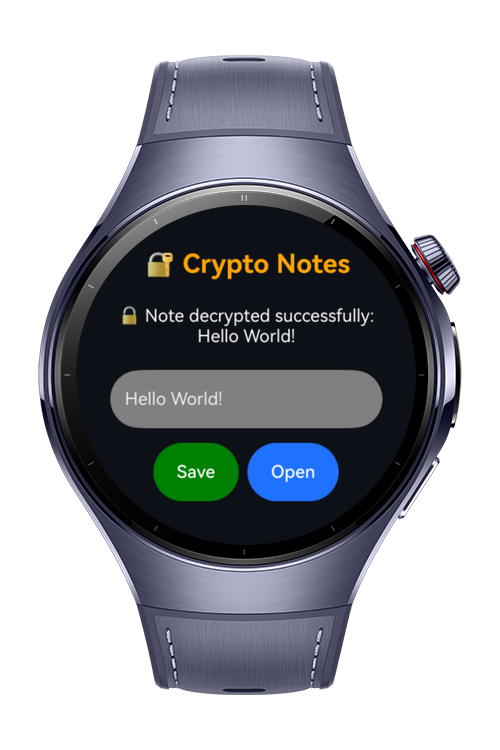

> **Note:** To access all shared projects, get information about environment setup, and view other guides, please visit [Explore-In-HMOS-Wearable Index](https://github.com/Explore-In-HMOS-Wearable/hmos-index).

# Crypto Notes
**Crypto Notes** is a lightweight HarmonyOS wearable app that demonstrates secure note storage with encryption and decryption using the HarmonyOS Crypto Framework. Users can type a note, encrypt it for storage, and decrypt it back for reading. The app also logs key interactions for clarity and debugging.

This project showcases secure state management, encryption handling, and user interaction on HarmonyOS wearable devices.

# Preview
<div>
  
  
  
</div>

# Use Cases
- **Secure Notes**: Users can write personal notes and save them in encrypted form.
- **Encryption & Decryption**: Implements symmetric key encryption using HarmonyOS Crypto Framework.
- **Logging**: Displays user actions (note typed, encrypted, decrypted, errors).
- **Responsive UI**: Minimal, simple, and designed for small wearable screens.
- **Educational Example**: Demonstrates practical usage of `@kit.CryptoArchitectureKit` and `buffer`.

# Technology
## Stack
- **Languages**: ArkTS, ArkUI
- **Frameworks**: HarmonyOS SDK 5.0.2(14)
- **Tools**: DevEco Studio Version 5.1.0.828
- **Libraries**:
    - `@kit.ArkUI`
    - `@kit.CryptoArchitectureKit`

## Required Permissions
- No permissions required.

# Directory Structure
```
Crypto Notes
|--- entry/src/main/ets/
| |--- util/
| | |--- CryptoService.ets
| |
| |--- pages/
| | |--- Index.ets
| |
| |--- resources/
| |--- screenshots/
```

# Constraints and Restrictions
## Supported Device
* Huawei Watch 5

# License
**Crypto Notes** is distributed under the terms of the MIT License.  
See the [LICENSE](./LICENSE) for more information.